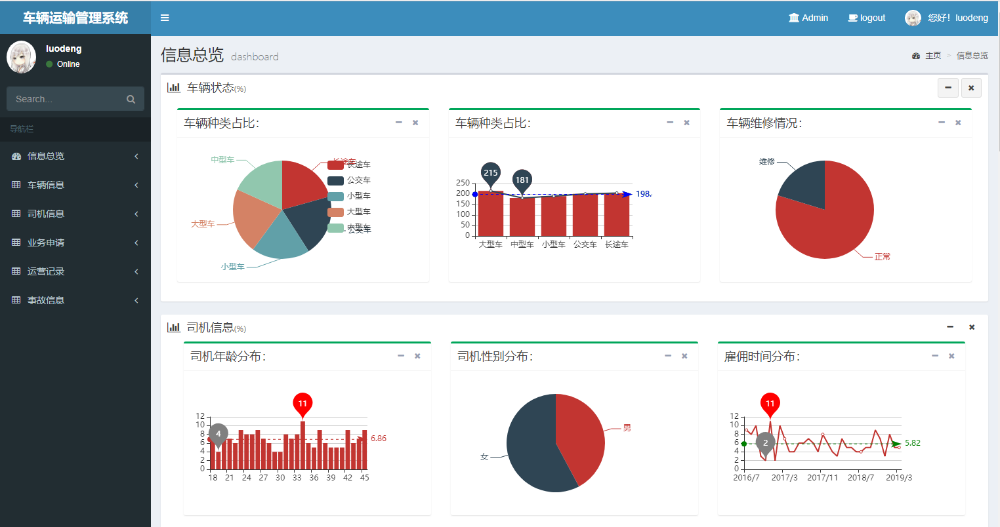
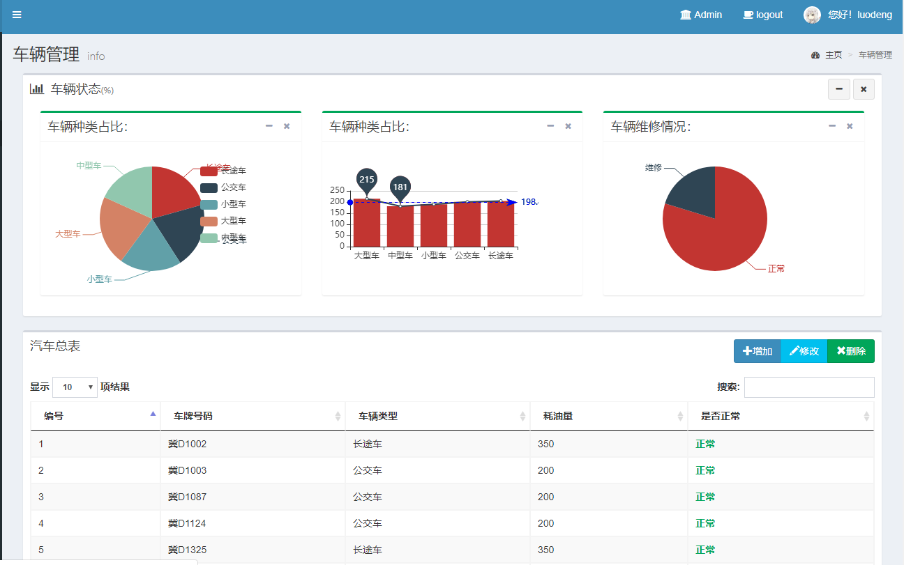

[](https://travis-ci.com/RonDen/2018DBDesign)

# 2018数据库原理课程设计

Author: LuoD

Time: 2018/01/04

This is my curriculum Design of Database Princeple. Based on Python and Django, thanks to the wellknown EChat.js, 
it is great for data visualization.

-----

## 运行效果 View Result

信息概览


车辆管理


## 使用方法 Usage

1. clone this repo
```
$ git clone https://github.com/RonDen/2018DBDesign.git
```
2. check dependencies
运行需要Django(2.1.7),推荐使用conda管理。MySQL8.0。
```
$ conda activate envname
$ pip install Django==2.1.7 # if not installed
$ # or use the requirement.txt
$ pip install -r requirement.txt
```
3. 删除迁移文件，删除APP下面migrations文件夹下除`__init__.py`文件的所有文件
4. 根据`settings.py`配置数据库连接。
5. 重新生成迁移文件
```
$ cd DBDesign
$ python manage.py makemigrations
$ python manage.py migrate
```
6. use the scripts in `utils/` to generate some dummy data in the database for better view. I recommend use the django shell with ipython enchance. Or you can use the `transportation.sql` to **quick start**(heavily recommanded!).

**Start DB Method 1**:
```
$ python manage.py shell
$ %cd utils # 使用utils文件夹下的脚本生成数据库中数据
$ run createUser.py
$ run insert2.py  # you can modify the num in this script for your prefer.
$ run insert_record.py
$ run addGroup.py
$ run changetime.py  # change time to make it more random
```
**Start DB Method 2**:
```
$ mysql -uroot -ppassword
mysql> use transportation; # if not exists, create it.
mysql> source transportation.sql;
```
7. runserver and open your browser view the result
```
$ python manage.py runserver
```
if these no errors and warnings, just open http://127.0.0.1:8000 in your browser to see the result.
